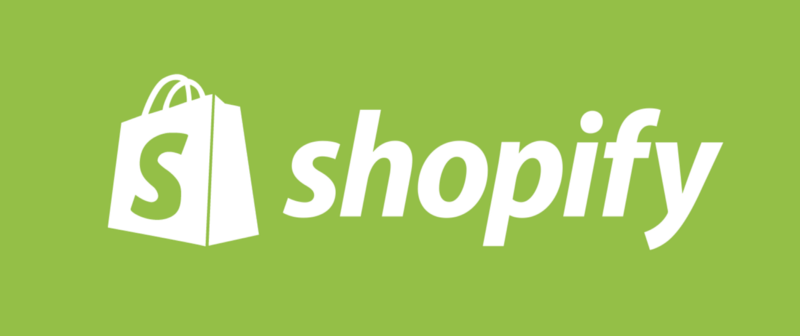

<p align="center">
<a href="https://docs.google.com/document/d/13zXpyrC2yGxoLXKktxw2VJG2Jw8SdUfliLM-bYQLjqE/edit#" target="_blank"></a>
</p>

<h1 align="center">Shernan Javier's Shopify Front End Internship Challenge Submission - Summer 2022</h1>

<p align="center">You can access the deployed site on <a href="https://shernanjavier-shopify-challenge-2022.netlify.app/">https://shernanjavier-shopify-challenge-2022.netlify.app/</a></p>

## Setting up the project

### Firstly, Clone the project

```bash
git clone https://github.com/ShernanJ/shopify-frontend-summer-2022.git
cd shopify-frontend-summer-2022
```

### Secondly, You would need to get an API Key from https://api.nasa.gov/

1. Create a new file called `.env.local` inside the folder.
2. Replace `{NASA API KEY HERE}` with api key provided by NASA.

```bash
echo "API_KEY='{NASA API KEY HERE}'" > .env.local
```

### Install all the necessary packages using npm install:

```bash
npm install
```

### Run the Development Server

```bash
npm run dev
```

### Open localhost:3000

[localhost:3000](http://localhost:3000)

## Features

- Infinite Scrolling
- Quotes Generator
- Like Post Feature (Saved Locally)
- Random Posts after initial 3 (initial 3 used to show local likes works)
- Like Button Animation
- Loading state

### Incomplete features (Optional and Personally planned)

- Date picker
- Reveal more / Reveal less button on paragraph
- Popup for each image with shareable link

## Technologies

<div align="center" id="technologies">
 

Below is a table that provides an overview of the technologies I was working with. (and a cute moose I made above.)

<table>
  <tr>
    <th>Front-End</th>
    <th>SSR Framework</th>
    <th>Deployed On</th>
  </tr>
  <tr> 
    <td></td>
    <td></td>
    <td></td>
  </tr>
 </table>
</div>
